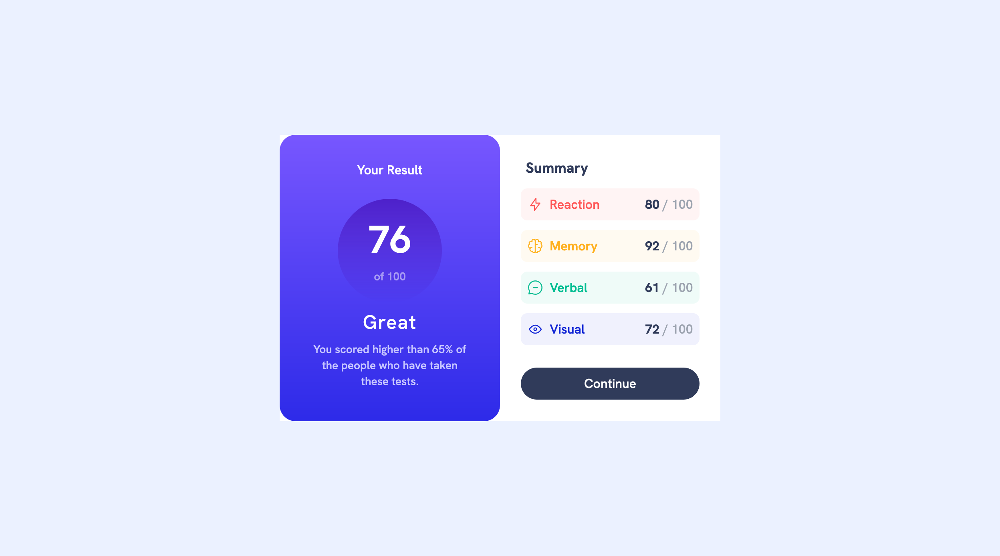
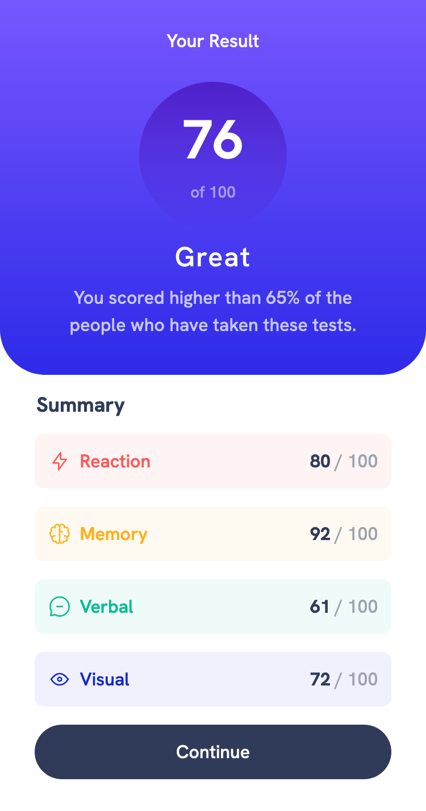

# Frontend Mentor - Results summary component solution

This is a solution to the [Results summary component challenge on Frontend Mentor](https://www.frontendmentor.io/challenges/results-summary-component-CE_K6s0maV). Frontend Mentor challenges help you improve your coding skills by building realistic projects.

## Table of contents

- [Overview](#overview)
  - [The challenge](#the-challenge)
  - [Screenshot](#screenshot)
  - [Links](#links)
- [My process](#my-process)
  - [Built with](#built-with)
  - [What I learned](#what-i-learned)
  - [Useful resources](#useful-resources)
  - [Acknowledgments](#acknowledgments)

## Overview

### The challenge

Users should be able to:

- View the optimal layout for the interface depending on their device's screen size
- See hover and focus states for all interactive elements on the page

### Screenshot

|  |  |
| ------------------------------------------------------------------- | ----------------------------------------------------------------- |

### Links

- [My Solution](https://your-solution-url.com)
- [Live Site URL](https://your-live-site-url.com)

## My process

### Built with

- Semantic HTML5 markup
- CSS custom properties
- Flexbox
- CSS Grid
- Mobile-first workflow

### What I learned

I learnt how to use tailwind css and being able to apply it.

### Useful resources

#### - [Stackoverflow](https://stackoverflow.com/) - This is a great site for solutions to your problems, especially if you get stucked.

#### - [MDN DOCS](https://developer.mozilla.org/) - This is an amazing site to read about the documentations of html, css and javascript properties.

#### - [Google Fonts](https://fonts.google.com/) - For all kinds of font styles, this is highly recommended.

#### - [Tailwind css](https://tailwindcss.com/) - The official tailwind css documentation.

### Acknowledgments

I learnt tailwind css from this two great tutorials. I really do thank them both

[Traversy Media Tailwind Crash Course](https://www.youtube.com/watch?v=dFgzHOX84xQ)

[The Net Ninja tutorial tailwind playlist](https://www.youtube.com/playlist?list=PL4cUxeGkcC9gpXORlEHjc5bgnIi5HEGhw)
